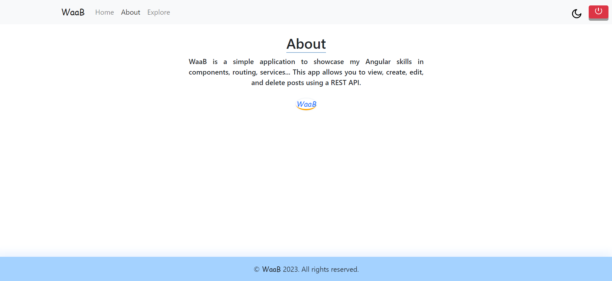
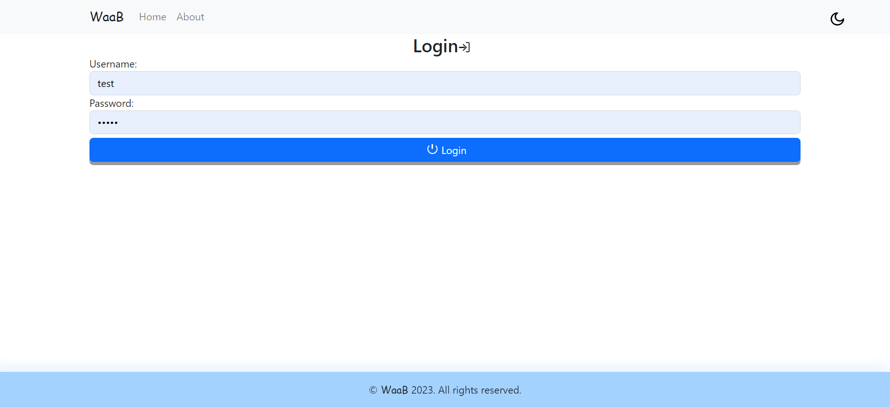
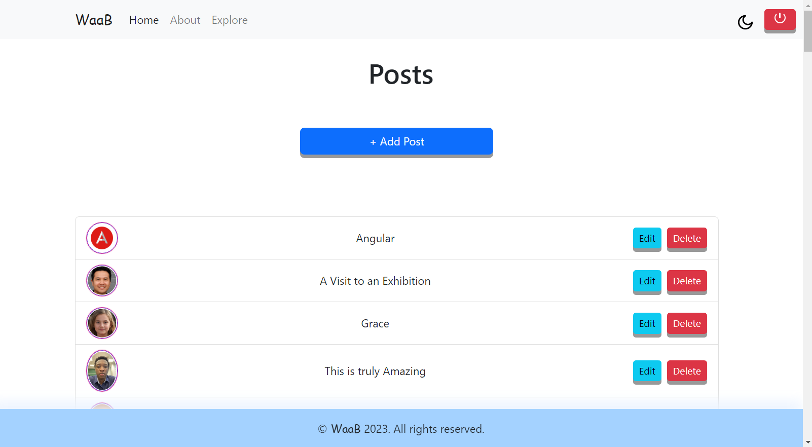

## [WAAB](https://www.linkedin.com/in/waab/)(WALID AHMAD ABDULLAHI) ##

---------ABOUT------------  
A portfolio project from scratch, geared towards showcasing my personal strengths in ANGULAR framework.  
Idea: SNR Frontend ENG Recruitment Task(Volvo)  

Start date: 05 AUG 2023.  
UID: test  
PWD: test@  

----------RUN-------------  
Intall all dependencies ~ `npm install`  
2 terminals  
T1: json-server --watch db.json  
T2: ng serve  

-----------------------REMARKS------------------------    
## The most pertinent functionalities   

- Ease of use  
- Correct Implementation of Logic  
- Proper Authentication and routing  
- Proper API Requests  
- Design Responsiveness  
- simplicity and cleanliness of design.  

***********************NOTE************************  

- Images are either free to use, mine or AI Generated  
- A good amount of test cases/best practices were considered.  
- This project is intentionally mostly TS/JS code based.  

 

 
